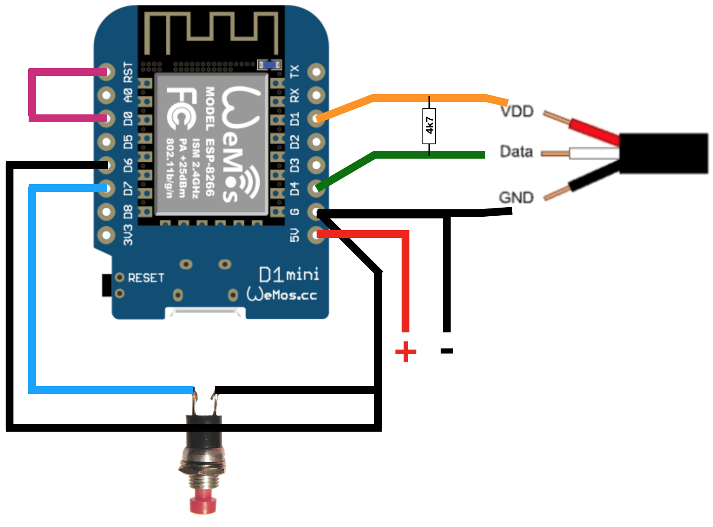
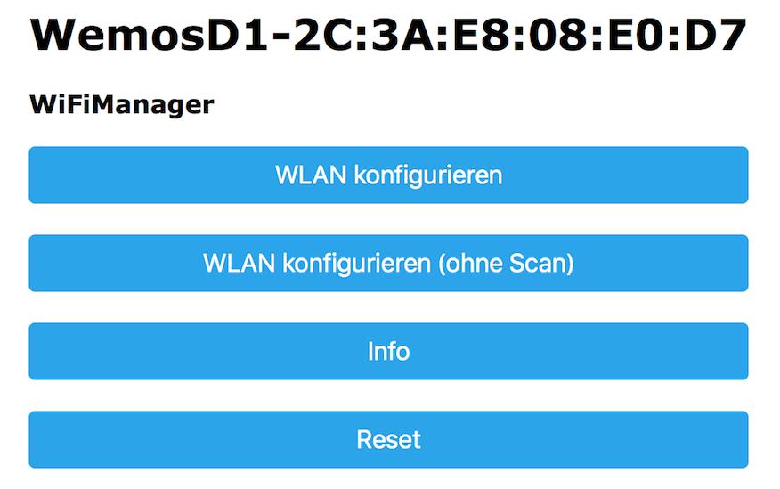

# !!! Discontinued !!! 
# Wemos D1 als HomeMatic Temperatur- / Luftfeuchtesensor  
# Dieses Projekt wird nicht weiter gepflegt, da die Einbindung über 868MHz sinnvoller erscheint. <br>Nähere Informationen gibts [hier](https://github.com/jp112sdl/Beispiel_AskSinPP).<br> Im "examples"-Ordner befinden sich die Projektdateien für die Sensoren

## Folgende Bauteile werden benötigt:
- Wemos D1 Mini
- DHT22/AM2302  - ODER - DS18B20 Sensor
  - bei Verwendung des DS18B20 wird ein 4k7 Widerstand benötigt
- 1 Taster (nicht dauerhaft, nur um bei erster Inbetriebnahme / Änderungen den Konfigurationsmodus zu starten)
- Stromversorgung (z.B. ein Batteriehalter mit 3x AA Batterien)


Anschluss eines DHT22/AM2302 Sensors


Anschluss eines DS18B20 Sensors

**Wichtig: Die Drahtbrücke zwischen GND und D6 dient der Erkennung des DS18B20-Modus und wird somit auch nur beim Betrieb mit einem DS18B20 Temperaturfühlers benötigt.**

## Flashen
Wenn alles nach obigem Bild verdrahtet wurde, kann das Image ```WemosD1_HomeMatic_WiFiSensor.ino.d1_mini.bin``` auf den Wemos geflasht werden.

**Hinweis: Der Flash-Vorgang funktioniert nur ohne Brücke zwischen D0/RST. Diese ist daher bestenfalls erst nach dem Flashen einzulöten** 

#### Vorgehensweise:
1. Voraussetzungen:
  - CH340-Treiber installieren
  - [esptool](https://github.com/igrr/esptool-ck/releases) herunterladen
2. WemosD1 mit einem microUSB-Kabel an den PC anschließen
3. Bezeichnung des neuen COM-Ports im Gerätemanager notieren (z.B. COM5)
4. Flash-Vorgang durchführen: 

  ```esptool.exe -vv -cd nodemcu -cb 921600 -cp COM5 -ca 0x00000 -cf WemosD1_HomeMatic_WiFiSensor.ino.d1_mini.bin```

## Voraussetzungen: 
- installiertes CUxD-Addon auf der CCU und ein Thermostat-Device 

mit folgenden Einstellungen in der WebUI:

**Hinweis: Die Einstellung "MODE TEMP+HUM" ist nur bei Verwendung eines DHT22-Sensors notwendig.**

## Konfiguration des Wemos D1
Um den Konfigurationsmodus zu starten, muss der Wemos D1 mit gedrückt gehaltenem Taster gestartet werden.
Die blaue LED blinkt kurz und leuchtet dann dauerhaft. 

Der Konfigurationsmodus ist nun aktiv.

Auf dem Handy oder Notebook sucht man nun nach neuen WLAN Netzen in der Umgebung. 

Es erscheint ein neues WLAN mit dem Namen "WemosD1-xx:xx:xx:xx:xx:xx"

Nachdem man sich mit diesem verbunden hat, öffnet sich automatisch das Konfigurationsportal.

Geschieht dies nicht nach ein paar Sekunden, ist im Browser die Seite http://192.168.4.1 aufzurufen.



**WLAN konfigurieren auswählen**


**SSID**: WLAN aus der Liste auswählen, oder SSID manuell eingeben

**WLAN-Key**: WLAN Passwort

**IP der CCU2**: selbsterklärend

**CUxD Device Seriennumer**: Seriennummer des CUxD Devices, meist ```CUX9002001``` für das erste Thermostat-Device

**Übertragung alle x Minuten**: Sende-Intervall. Zwischen den Übertragungen verbleibt der Wemos D1 im DeepSleep Modus, um Energie zu sparen. Je größer die Sendeabstände, desto länger ist die Lebensdauer der Batterien


**Beispiel**

#### Nach dem "Speichern" startet der Wemos neu und es findet eine Übertragung der Werte an die CCU statt. In der HomeMatic WebUI sollten nun Werte bei dem Temperatursensor (in der WebUI unter "Status und Bedienung" -> "Geräte") zu sehen sein


